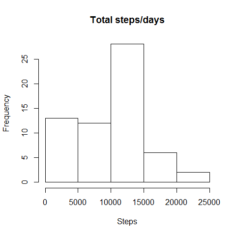
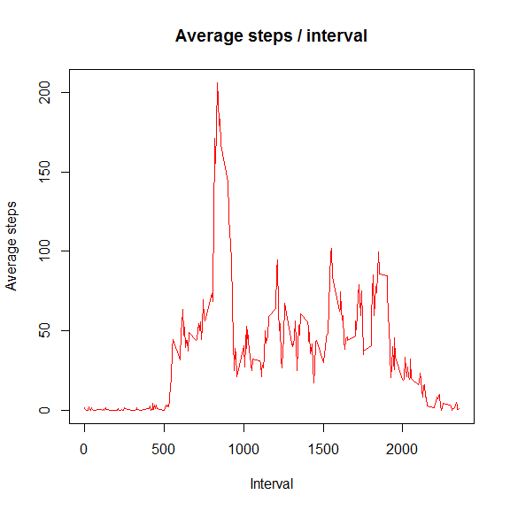
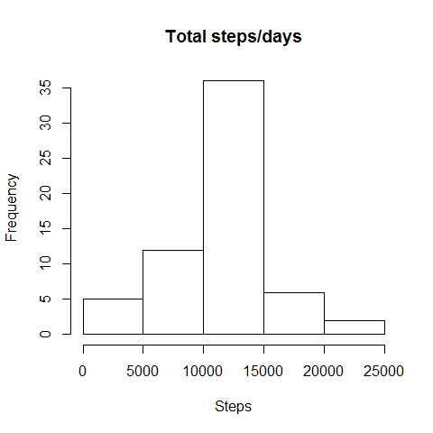

# Reproducible Research Assignment 1

**1) What is mean total number of steps taken per day?**

```r
require(knitr)
```

```
## Loading required package: knitr
```

```
## Warning: package 'knitr' was built under R version 3.1.3
```

```r
opts_chunk$set(echo = TRUE, cache = TRUE, cache.path = "cache/", fig.path = "figure/")

data <- read.csv(".\\data\\activity.csv")
totalperday <- tapply(data$steps, data$date, sum, na.rm=TRUE)
head(totalperday)
```

```
## 2012-10-01 2012-10-02 2012-10-03 2012-10-04 2012-10-05 2012-10-06 
##          0        126      11352      12116      13294      15420
```

```r
summary(totalperday)
```

```
##    Min. 1st Qu.  Median    Mean 3rd Qu.    Max. 
##       0    6778   10400    9354   12810   21190
```
Histogram


```r
hist(totalperday, main="Total steps/days", xlab="Steps")
```

 


```r
m <- mean(totalperday)
med <- median(totalperday)
print(m)
```

```
## [1] 9354.23
```

```r
print(med)
```

```
## [1] 10395
```
**2)What is the average daily activity pattern?**


```r
avgstep <- aggregate(data$steps, list(data$interval), mean, na.rm=TRUE)
head(avgstep)
```

```
##   Group.1         x
## 1       0 1.7169811
## 2       5 0.3396226
## 3      10 0.1320755
## 4      15 0.1509434
## 5      20 0.0754717
## 6      25 2.0943396
```

```r
tail(avgstep)
```

```
##     Group.1         x
## 283    2330 2.6037736
## 284    2335 4.6981132
## 285    2340 3.3018868
## 286    2345 0.6415094
## 287    2350 0.2264151
## 288    2355 1.0754717
```

```r
summary(avgstep)
```

```
##     Group.1             x          
##  Min.   :   0.0   Min.   :  0.000  
##  1st Qu.: 588.8   1st Qu.:  2.486  
##  Median :1177.5   Median : 34.113  
##  Mean   :1177.5   Mean   : 37.383  
##  3rd Qu.:1766.2   3rd Qu.: 52.835  
##  Max.   :2355.0   Max.   :206.170
```

```r
names(avgstep[1]) <- "interval"
names(avgstep[2]) <- "avgsteps"
```


```r
# require(knitr)
# opts_chunk$set(echo = TRUE, cache = TRUE, cache.path = "cache/", fig.path = "figure/")
plot(avgstep, type="l", col="red", main="Average steps / interval", xlab="Interval", ylab="Average steps")
```

 


```r
avgstep[[2]][1]
```

```
## [1] 1.716981
```

```r
maxavg <- max(avgstep[[2]])
len <- length(avgstep[[2]])
print(maxavg)
```

```
## [1] 206.1698
```

```r
for(x in 1:len){
  if(avgstep[[2]][x] == maxavg) { break }
  else { x = x + 1 }
}
print(x)
```

```
## [1] 104
```
5-min interval, on average across all the days in the dataset, contains the maximum number of steps:

```r
print(avgstep[[1]][x])
```

```
## [1] 835
```
###3)Inputing missing values
The total number of missing values in the dataset:

```r
sum(is.na(data$steps))
```

```
## [1] 2304
```

Change NA value to the average steps of the interval, new dataset is data2

```r
data2 <- data

len1 <- length(data2$steps)
len2 <- length(avgstep[[1]])
for(x in 1:len1){
  if(is.na(data2$steps[x])) {
    int <- data2$interval[x]
    for(y in 1:len2){
      if(avgstep[[1]][y] == int) { break }
      else {y = y + 1}
    }
    data2$steps[x] <- avgstep[[2]][y]
  }
}

head(data2)
```

```
##       steps       date interval
## 1 1.7169811 2012-10-01        0
## 2 0.3396226 2012-10-01        5
## 3 0.1320755 2012-10-01       10
## 4 0.1509434 2012-10-01       15
## 5 0.0754717 2012-10-01       20
## 6 2.0943396 2012-10-01       25
```

```r
tail(data2)
```

```
##           steps       date interval
## 17563 2.6037736 2012-11-30     2330
## 17564 4.6981132 2012-11-30     2335
## 17565 3.3018868 2012-11-30     2340
## 17566 0.6415094 2012-11-30     2345
## 17567 0.2264151 2012-11-30     2350
## 17568 1.0754717 2012-11-30     2355
```
Make a histogram of the total number of steps taken each day and Calculate and report the mean and median total number of steps taken per day. Do these values differ from the estimates from the first part of the assignment? What is the impact of imputing missing data on the estimates of the total daily number of steps?
In the first part of the assignment, mean1 = 9354.23 and median1 = 10395; while in the 2nd part, both mean2 and median2 = 10766.1


```r
totalperday2 <- tapply(data2$steps, data2$date, sum, na.rm=TRUE)
head(totalperday2)
```

```
## 2012-10-01 2012-10-02 2012-10-03 2012-10-04 2012-10-05 2012-10-06 
##   10766.19     126.00   11352.00   12116.00   13294.00   15420.00
```

```r
summary(totalperday2)
```

```
##    Min. 1st Qu.  Median    Mean 3rd Qu.    Max. 
##      41    9819   10770   10770   12810   21190
```
Histogram


```r
# require(knitr)
# opts_chunk$set(echo = TRUE, cache = TRUE, cache.path = "cache/", fig.path = "figure/")
hist(totalperday2,main="Total steps/days", xlab="Steps")
```

 


```r
m2 <- mean(totalperday2)
med2 <- median(totalperday2)
print(m2)
```

```
## [1] 10766.19
```

```r
print(med2)
```

```
## [1] 10766.19
```
